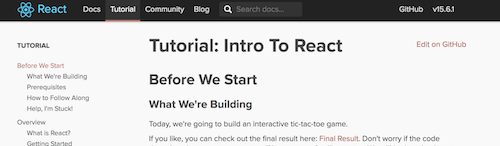
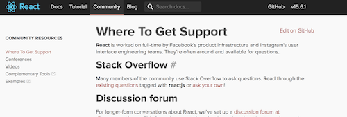
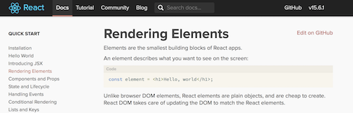

#  Exploring Documentation

### Learning Objectives
*After this lesson, you will be able to:*
- Read through the React documentation
- Apply concepts in the React documentation

## Documentation

When you don't know how to do something in programming, a great place to check is the documentation. Some frameworks have documentation that's very dense and difficult to parse, but others are much more straightforward. Luckily, React.js is one of the more well written ones!

You're going to be looking at the React documentation to practice learning on your own. This lesson doesn't have a lot of answers in it, because the hope is that you'll be able to find them yourself! We'll be here to point you in the right direction.

## Looking at the React Website

First, open the [React homepage](https://facebook.github.io/react/). Since React was created by Facebook, it has a large community with a lot of information.

- First, click "Tutorial" at the top. This is a tutorial created by Facebook to walk you through learning React - it's the tic tac toe game from the last lesson!
  - If that last exercise was a little confusing, it might be worth pausing this lesson to run through the Facebook tutorial and reinforce what we've learned so far.

### The React community

- Click "Community".

Here are many recommended places to ask for help. However, make sure that you try your best to find the answer first! Many frameworks don't have such a large community, so being able to find the answer on your own is crucial. As well, while a problem might seem dire, the solution might be a single command or short explanation found in the documentation.

That said, looking through questions that have been asked previously is a great place for research. If you're having a problem, chances are high that someone else once had that same problem.

### The React documentation

- Now, let's dive in. Click "Docs".

In the left sidebar is a nav bar containing a quick start guide, advanced guides, and references (as well as how to contribute, which you could do some day!).

- In the left sidebar, click "Rendering Elements." Read through the page, paying attention to the examples. Hopefully, this is all review and relatively straightforward.

Congratulations! You've read a page of React.js documentation.

### Documentation Exercise: Conditional Rendering

Now, let's apply something new. In the search bar at the top, look for "Conditional Rendering".

- Read through the page.

- Now, look at [this CodePen](https://codepen.io/SuperTernary/pen/wrooQP). It's the fruit filter from before; currently, it only lists the matching fruits (however, it has the functions to make the list for the unmatching ones).

- **Task:** Referring to the Conditional Rendering documentation, finish this application so there's only a single list displayed at any time, with a corresponding button changes between "Show matching fruits" and "Show unmatching fruits".
  - The two functions creating the buttons have been made for you, below the class declaration.
  - The `return` method in the `render` methodis accurate; as well as the `handleFilterChange()` method - no modifications are needed in either `handleFilterChange()` or the `return`.

Here are screenshots of the two different states of the app:

**For a hint**: There is a comment everywhere you need to make a modification in [this CodePen](https://codepen.io/SuperTernary/pen/qPqqQE?editors=0010).

**When you have it, check your solution against** [this CodePen](https://codepen.io/SuperTernary/pen/XeNNEG?editors=0010).
